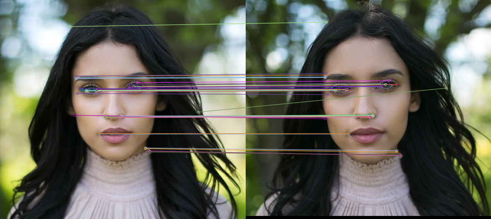

# OpenCV-Projects
Some basic Projects based on OpenCV and numpy libraries of PYTHON 3
# Edge Detection by adaptive threshold technique
canny edge detction code is also provided for better usage

# Smile detection using haarcascade of opencv
I have used frontal face default cascade and smile detection cascade to detect eyes and faces in live video or recorded video.

# Feature Detection
Compares two images using ORB_create, you can use SIFT_create, SURF_create if you have license of them. Some amount of CPU power is used as BRUTE FORCE method is used so it takes little bit time to produce output image.
# img1
    

